# Conditional-XVAE (cXVAE) Tutorial

Modeling Spatial-Temporal Extremes via Conditional Variational Autoencoders 

> Department of Statistics and Data Science, University of Missouri Columbia

## Introduction

This tutorial provides step-by-step instructions for implementing the cXVAE model, which extends the XVAE framework [[1]](#1) to incorporate climate indices as conditioning variables. By allowing the latent extremal-dependence parameters to evolve with observed climate drivers (e.g., ENSO), the model moves beyond stationarity assumptions and enables controlled generation of spatial extreme fields under specified climate conditions.

The implementation is in Python using PyTorch, with data preparation scripts in R. This work builds on the XVAE framework of Zhang et al. (2026) [[1]](#1) and is described in Ma et al. (2025) [[2]](#2).

## Dependencies

**R packages**
```r
install.packages(c("fields", "mgcv", "xts", "ismev", "ggplot2", "parallel", "zoo"))
```

**Python packages**
```bash
pip install torch numpy pandas scipy matplotlib cartopy tqdm imageio pillow
```

All experiments in the paper were performed on a desktop with an Intel Core i5-9600K CPU (3.70 GHz) and 48 GB RAM. No GPU is required.

## Repository Structure
 
```
Conditional-XVAE/
├── Simulation/
│   ├── simulate_data.R          # Data generation from the max-id model
│   ├── pretrain_CNN.py          # CNN pretraining for theta estimation
│   ├── train_cXVAE.py           # cXVAE model definition and training
│   ├── baseline_SohnCVAE.py     # Vanilla cVAE baseline (Sohn et al., 2015)
│   ├── evaluate.py              # Evaluation metrics and visualizations
│   └── utils.py                 # Shared utility functions
│
├── FWI Data Analysis/
│   ├── data_preparation.R       # FWI data processing and GEV transformation
│   ├── pretrain_CNN_FWI.py      # CNN pretraining for FWI analysis
│   ├── train_cXVAE_FWI.py       # cXVAE training and evaluation for FWI
│   └── utils.py                 # Shared utility functions
│
├── figures/                     # Result figures
├── README.md
└── LICENSE
```
 
---

## Part I: Simulation Study
 
The simulation study demonstrates the cXVAE on a 50×50 regular grid over $[0,20]\times[0,20]$, conditioned on the ENSO index (528 monthly time points, 1980–2023).

### Step 1: Generate Simulation Data (R)

Download the ENSO index from NOAA:
[https://psl.noaa.gov/data/climateindices/list/](https://psl.noaa.gov/data/climateindices/list/)
 
Then run the simulation script:
 
```r
source("Simulation/simulate_data.R")
```

The ENSO time series used as the condition variable $c_t$ is shown below. The three red dashed lines mark the representative El Niño, neutral, and La Niña periods used in the paper.

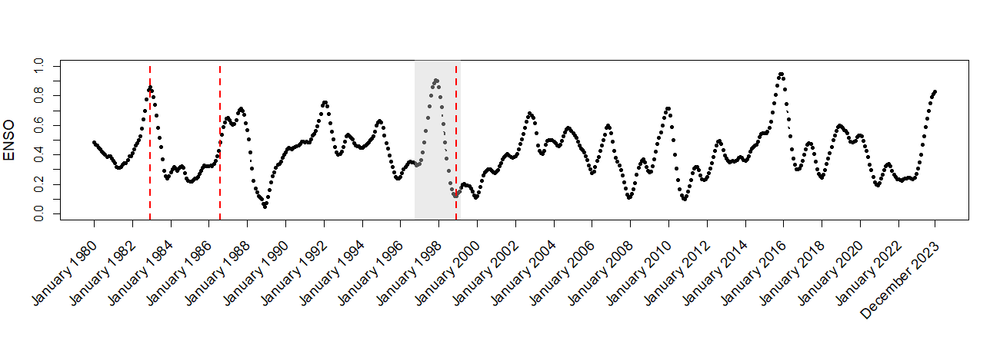

The tilting parameter field $\theta_t(c_t)$ governs the spatial extent of extremal dependence and evolves with the ENSO index. Low values of $\theta$ correspond to heavier-tailed latent variables. Below are three representative $\theta_t$ maps at El Niño (left), neutral (center), and La Niña (right) conditions:

| El Niño | Neutral | La Niña |
|:---:|:---:|:---:|
| 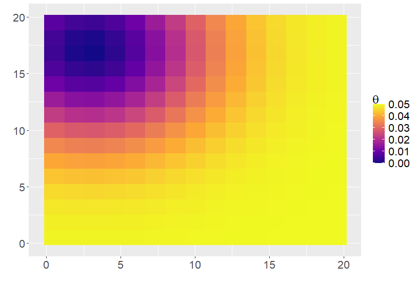 | 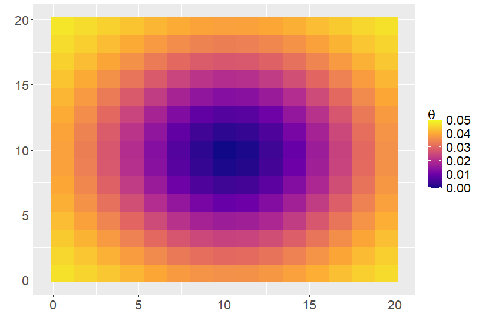 | 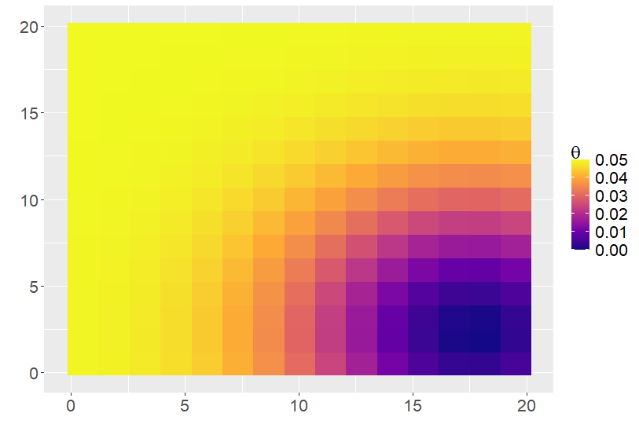 |

**Outputs** (saved as CSV):
 
| File | Description | Shape |
|------|-------------|-------|
| `X_Data.csv` | Observed spatial fields | 2500 × 528 |
| `Y_Data.csv` | Latent Y process | 2500 × 528 |
| `Z_Data.csv` | Latent expPS variables | 225 × 528 |
| `Thetas_Data.csv` | Tilting parameters | 225 × 528 |
| `W_Data.csv` | Wendland basis matrix | 2500 × 225 |
| `RBF_Data.csv` | RBF basis for theta | 225 × 144 |
| `MEIs_MA_Data.csv` | Smoothed ENSO index | 528 × 1 |

### Step 2: Pretrain the CNN (Python)
 
The CNN decoder is pretrained to estimate the tilting parameter field $\theta_t$ from the approximation of fused latent inputs $(\hat{Z}_t, c_t)$. This warm-start is strongly recommended before training the full cXVAE.
 
```python
python Simulation/pretrain_CNN.py
```
 
The pretrained weights are saved to `CNN_pretrained.pt`.

### Step 3: Train the cXVAE
 
```python
python Simulation/train_cXVAE.py
```

The cXVAE embeds a max-id extremes model within a conditional VAE framework. The encoder maps observed spatial fields to log-scale latent variables with ENSO injected as a linear conditioning term. The CNN decoder reconstructs the spatial process via a learnable basis matrix W and log-Laplace noise. Full model details are in Ma et al. (2025) [[2]](#2).
 
The best model (by validation loss) is saved to `cXVAE_trained.pt`.

### Step 4: Emulate Spatial Fields

After training, generate emulated samples by passing the observed data and condition through the trained model. The encoder maps the observed fields to the latent space, the condition $c_t$ is injected via the learned linear mapping $g(c_t)$, and new spatial fields are generated by introducing fresh log-Laplace noise at each call. Counterfactual emulations are obtained by substituting a different condition (e.g. flipped ENSO) while keeping the observed fields fixed:

```python
from train_cXVAE import cXVAE_emulate
 
# Factual emulation
emulated = cXVAE_emulate(model, n_samples=2000, condition_data=Nina34_input)
# Shape: (n_loc x n_t x n_samples)
```

The emulated fields closely match the true simulated fields in the both spatial pattern and magnitude:

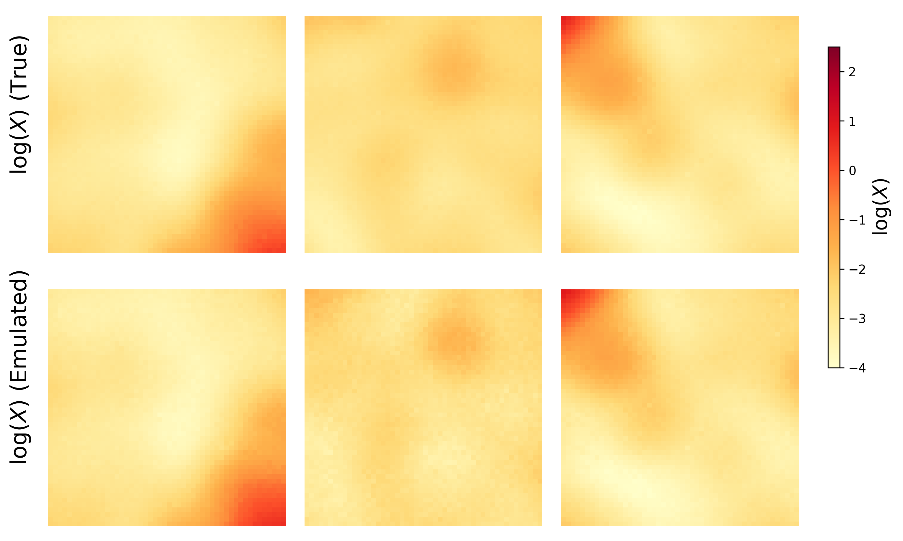

*Top row: true simulated $\log(X_t)$. Bottom row: emulated $\log(X_t)$. Columns correspond to El Niño (December 1997), neutral (June 1998), and La Niña (February 1999) conditions.*

### Step 5: Counterfactual Experiment

To access the effect of climate conditions, pass a counterfactual ENSO index through the trained model:

```python
enso_counterfactual = MEI_SCALE - Nina34_input   # flip ENSO signal
emulated_cf = cXVAE_emulate(model, n_samples=2000, condition_data=enso_counterfactual)
```

The kernel density plots below compare the joint distribution of two arbitrary spatial locations under the factual (red) and counterfactual (blue) ENSO signals at three representative times. The contours shift systematically in the direction consistent with the flipped ENSO index, confirming that the model meaningfully propagates climate information.
 
| December 1997 (El Niño) | June 1998 (Neutral) | February 1999 (La Niña) |
|:---:|:---:|:---:|
| 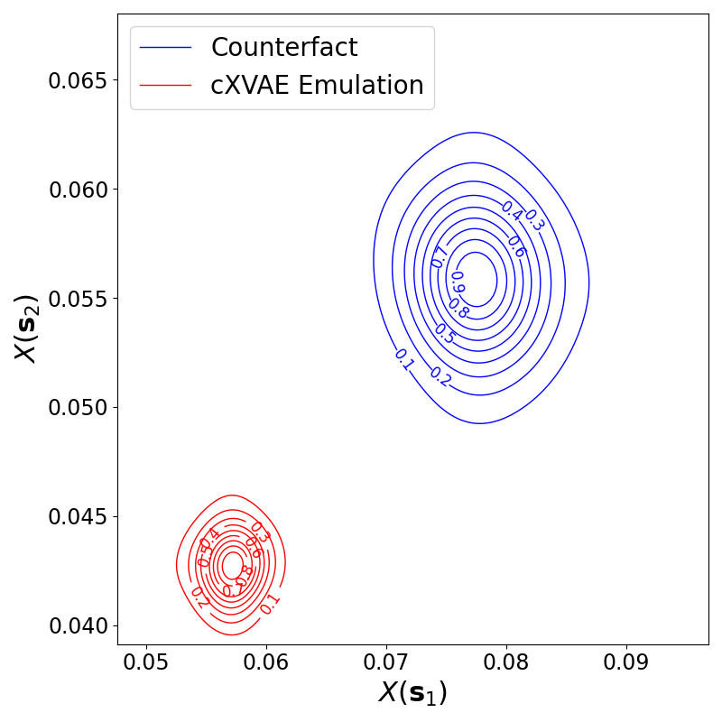 | 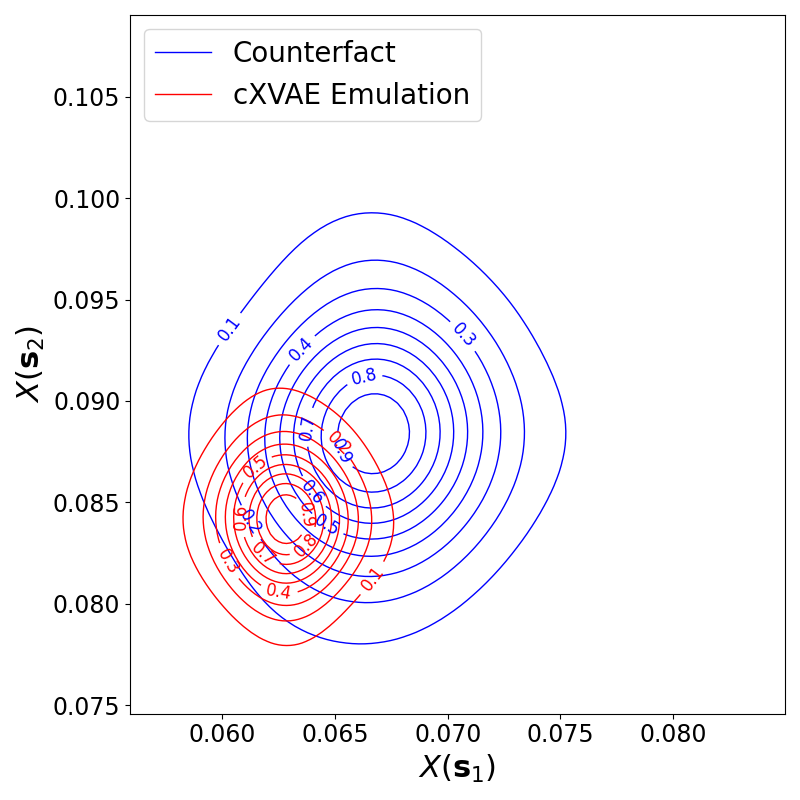 | 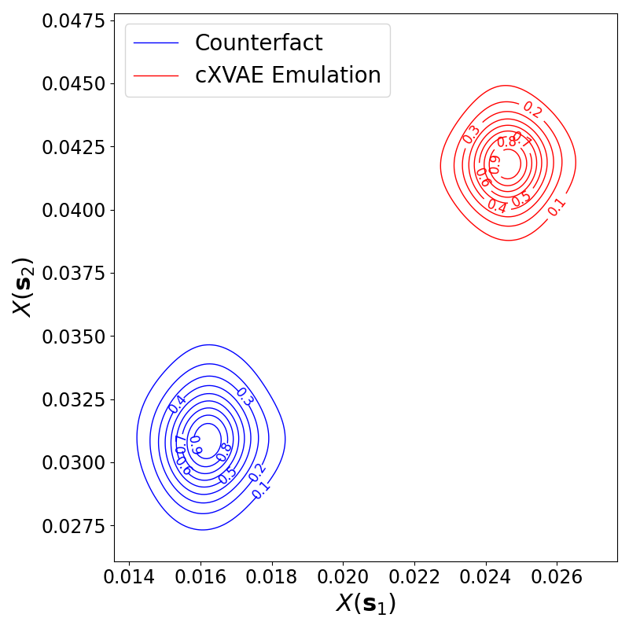 |

### Step 6: Baseline Comparison

A vanilla conditional VAE (Sohn et al., 2015)[[3]](#3) is included as a baseline. To ensure a fair comparison, its decoder is initializaed with the same Wendland basis as the cXVAE:

```python
python Simulation/baseline_SohnCVAE.py
```
 
### Step 7: Evaluation
 
```python
python Simulation/evaluate.py
```

**χ-coefficient**: The emulated χ curves (blue) closely follow those of the true data (red) across all spatial lags, capturing both strong short-range and weak long-range extremal dependence.

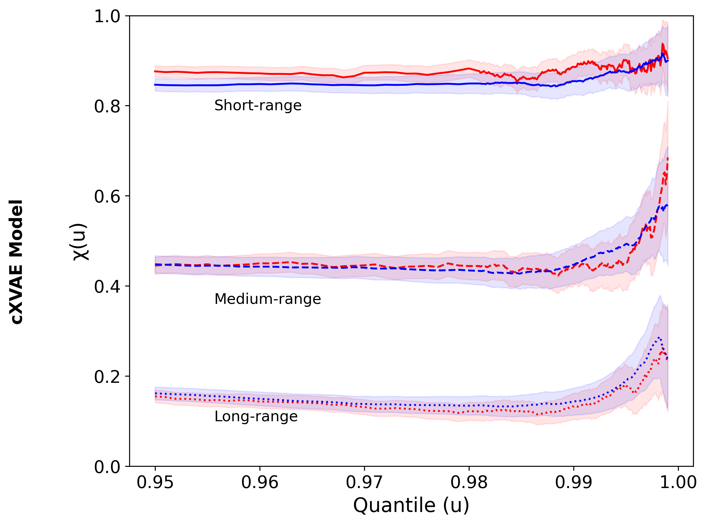
 
**Averaged Radius of Exceedances (ARE)**: The emulated ARE curve closely tracks the truth across all quantile levels, with overlapping 95% confidence intervals.
 
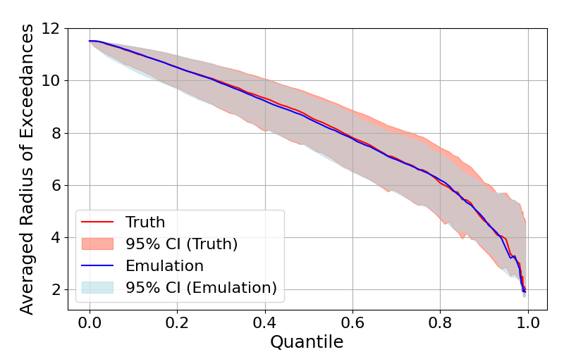

The evaluation script also produces tail-weighted CRPS violin plots and Q-Q plots saved to `figures/simulation/`.

---
 
## Part II: FWI Real Data Analysis

The real data analysis applies the cXVAE to monthly maximum Fire Weather Index (FWI) data over eastern Australia (May 2014 - November 2024), conditioned on the ENSO index.

### Step 1: Download Raw FWI Data

Raw daily FWI NetCDF files are available from the NASA NCCS Data Portal:
 
[https://portal.nccs.nasa.gov/datashare/GlobalFWI/](https://portal.nccs.nasa.gov/datashare/GlobalFWI/)
 
Files follow the naming convention: `FWI.GEOS-5.Daily.Default.YYYYMMDD.nc`

### Step 2: Data Preparation (R)
 
The preparation pipeline covers:
1. Extracting the target region (143.125°–150.9375°E, 33.75°–23.25°S) from NetCDF files
2. Filling missing values via local temporal interpolation
3. Computing monthly maxima
4. Removing seasonality via cubic spline detrending (`mgcv`)
5. Fitting GEV distributions location-wise and transforming margins

```r
source("FWI Data Analysis/data_preparation.R")
```
 
**Outputs** (saved as CSV):
 
| File | Description | Shape |
|------|-------------|-------|
| `X_Data.csv` | GEV-transformed FWI | 1118 × 127 |
| `W_Data.csv` | Wendland basis matrix | 1118 × 540 |
| `RBF_Data.csv` | RBF basis for theta | 540 × n_basis |
| `MEIs_Data.csv` | Normalized ENSO index | 127 × 1 |
| `GEV_par.csv` | Fitted GEV parameters | 1118 × 3 |
 
### Step 3: Pretrain the CNN
 
```python
python "FWI Data Analysis/pretrain_CNN_FWI.py"
```

The FWI analysis uses a 20×27 knot grid (540 knots) over the eastern Australia region, compared to the 15×15 grid (225 knots) in the simulation. The CNN architecture is otherwise identical. The pretrained weights are saved to `CNN_pretrained_FWI.pt`.
 
### Step 4: Train the cXVAE and Evaluate
 
```python
python "FWI Data Analysis/train_cXVAE_FWI.py"
```

This script trains the model, generates factual and counterfactual emulations, back-transforms to the original FWI scale via the inverse GEV transformation, and produces all evaluation figures.

**Spatial field comparison**: The estimated $\theta_t$ maps (top row) and true vs emulated $\log(X_t)$ fields (middle and bottom rows) at three representative time points corresponding to El Niño (November 2023), neutral (April 2024), and La Niña (October 2024) conditions.
 
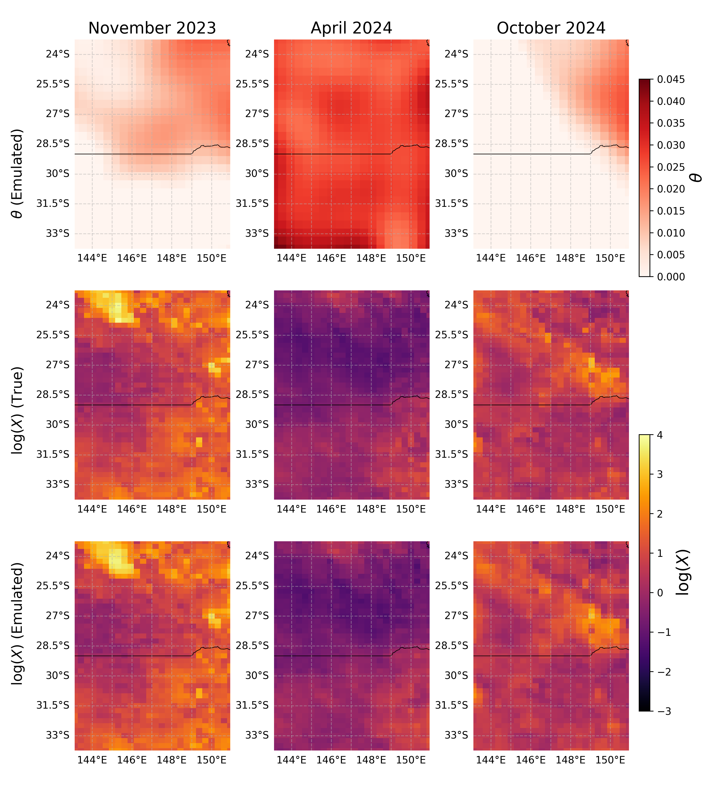

**Counterfactual experiment**: Kernel density contour plots comparing joint distributions of two spatial locations under factual (blue) and counterfactual (red) ENSO conditions. The minor differences indicate that ENSO contributes modestly to FWI in eastern Australia, consistent with the paper's findings.
 
| November 2023 (El Niño) | April 2024 (Neutral) | October 2024 (La Niña) |
|:---:|:---:|:---:|
| 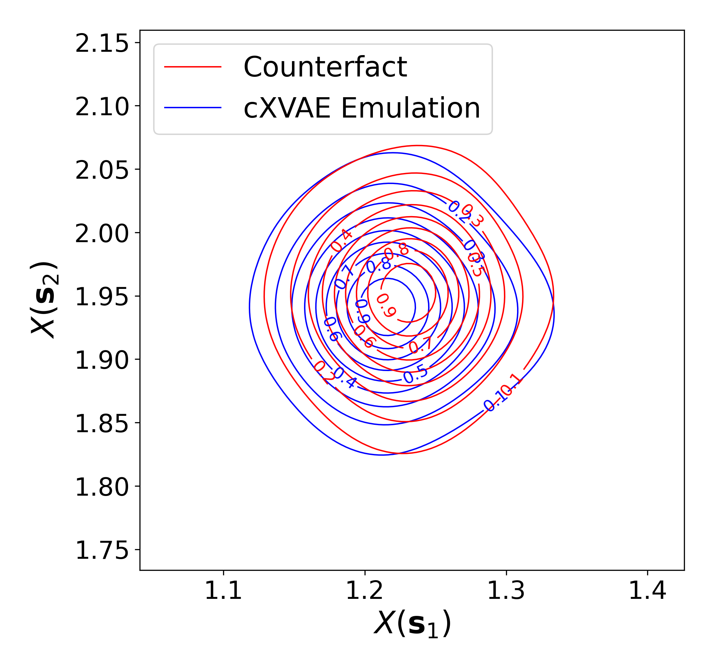 | 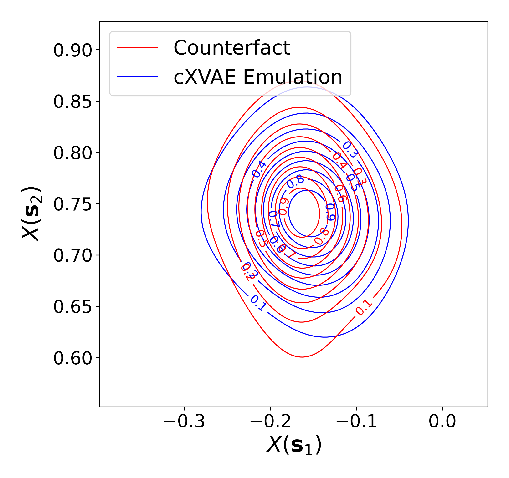 | 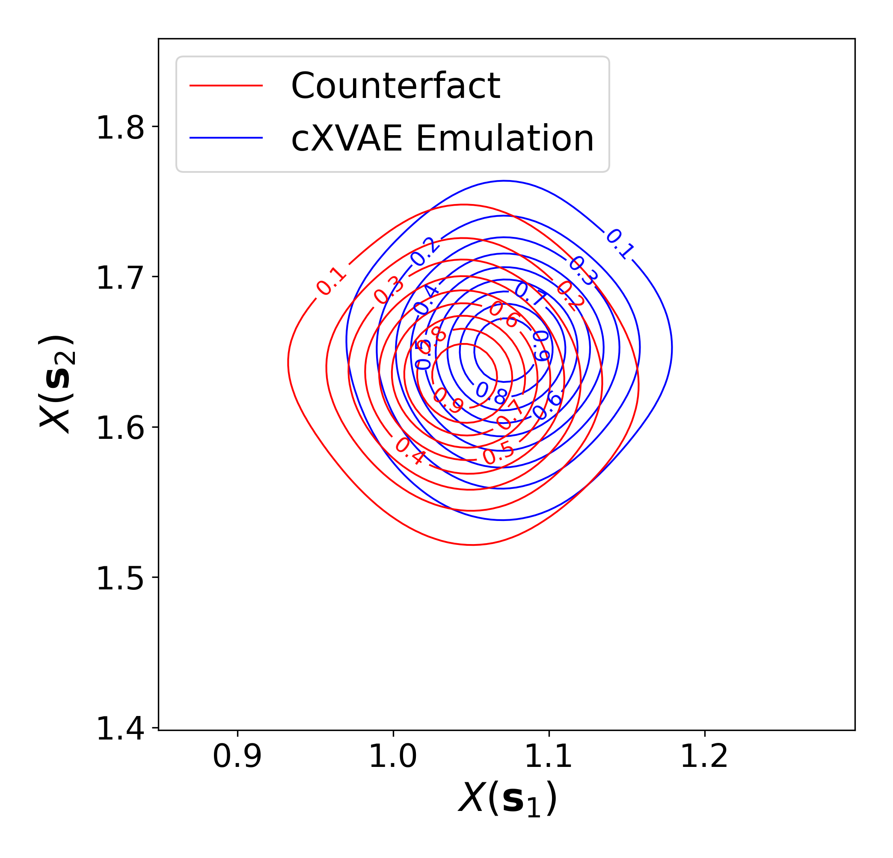 |
 
**χ-coefficient**: The emulated χ curves (blue) closely follow the true data (red) across all spatial lags.
 
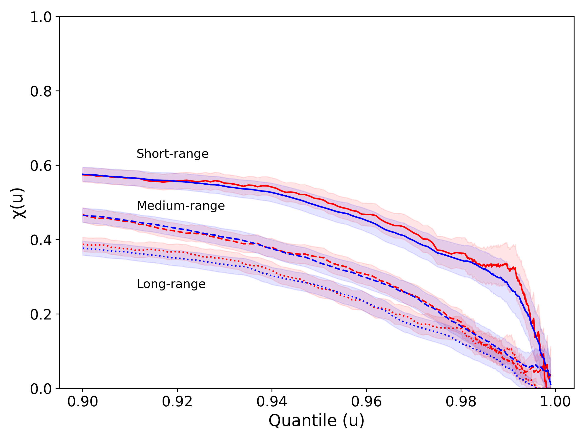
 
**Averaged Radius of Exceedances (ARE)**: The emulated ARE curve closely tracks the observed data with overlapping 95% confidence intervals.
 
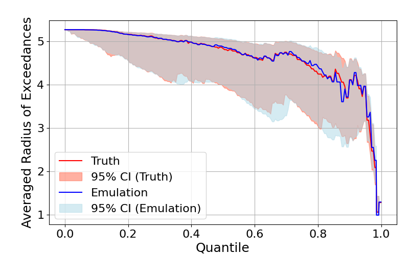
 
---
 
## Model Architecture Summary
 
| Component | Simulation | FWI |
|-----------|------------|-----|
| Spatial locations $n_s$ | 2,500 | 1,118 |
| Knots $K$ | 225 (15×15) | 540 (20×27) |
| Time points $n_t$ | 528 | 127 |
| Noise process | log-Laplace($0, 1/30$) | log-Laplace($0, 1/30$) |
| Optimizer | Adam, lr=$10^{-6}$ | Adam, lr=$10^{-7}$ |
 
---


## References
 
<a id="1">[1]</a>
Zhang, L., Ma, X., Wikle, C.K. and Huser, R. "Fast and flexible emulation of spatial extremes processes via variational autoencoders." *Journal of the American Statistical Association*, April, 1–14. doi:10.1080/01621459.2026.2621515.
 
<a id="2">[2]</a>
Ma, X., Zhang, L. and Wikle, C.K. "Modeling spatio-temporal extremes via conditional variational autoencoders."  *arXiv preprint* arXiv:2512.06348 (2025).
 
<a id="3">[3]</a>
Sohn, K., Lee, H. and Yan, X. "Learning structured output representation using deep conditional generative models." *Advances in Neural Information Processing Systems*, 28, (2015).

